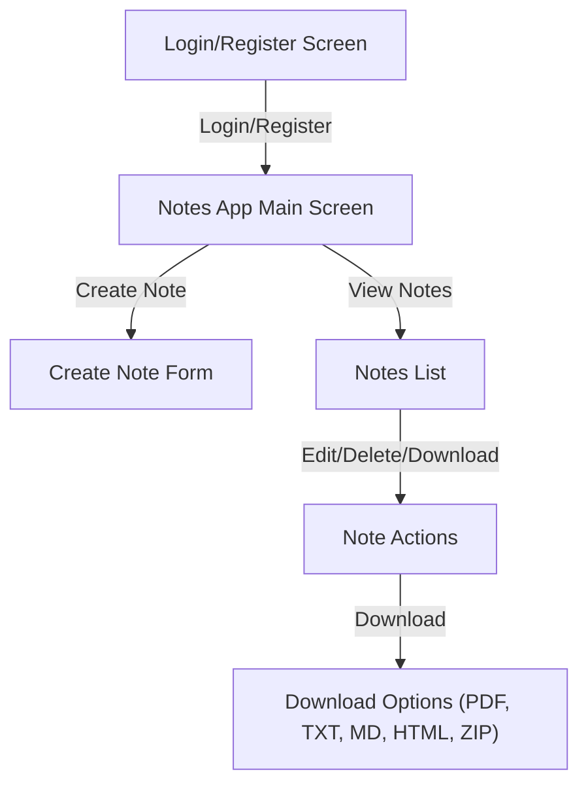

# Notes App

A simple, modern notes application with authentication, categories, file attachments, and download options. Share functionality has been removed for privacy and security.

---

## Features
- User registration and login
- Create, edit, and delete notes
- Organize notes by category
- Attach files to notes
- Download notes in PDF, TXT, Markdown, HTML, or ZIP (with attachments)
- Responsive, clean UI

---

## App Flow



---

## Getting Started

### Prerequisites
- Node.js (v16+ recommended)
- MySQL database

### Installation
1. Clone the repository:
   ```bash
   git clone <repo-url>
   cd notes-app
   ```
2. Install dependencies:
   ```bash
   npm install
   ```
3. Configure your `.env` file (see `.env.example` for reference)
4. Set up the database using `database.sql`.
5. Start the server:
   ```bash
   npm start
   ```
6. Open [http://localhost:3001](http://localhost:3001) in your browser.

---

## Usage
- Register a new account or login.
- Create notes, select categories, and attach files if needed.
- Download notes in your preferred format using the green **Download** button.
- Download with attachments as a ZIP if a note has a file attached.

---

## License
MIT

## Deployment Instructions

###  Set Environment Variables
NODE_ENV=production
DB_HOST=your_mysql_host
DB_USER=your_mysql_username
DB_PASSWORD=your_mysql_password
DB_NAME=your_mysql_database
JWT_SECRET=your_jwt_secret_key

## Local Development
1. Clone the repository
2. Copy `.env.example` to `.env` and fill in your values
3. Install dependencies: `npm install`
4. Start the server: `npm start`
5. Access the app at `http://localhost:3001`

## Security Notes
- Never commit `.env` file
- Use strong passwords
- Keep JWT_SECRET secure
- Regularly update dependencies

## Prerequisites

- Node.js (v14 or higher)
- MySQL (v8 or higher)
- npm or yarn package manager

## Setup

1. Clone the repository:
```bash
git clone <repository-url>
cd notes-app
```

2. Install dependencies:
```bash
npm install
```

3. Create a `.env` file in the root directory with the following content:
```
DB_HOST=localhost
DB_USER=your_mysql_username
DB_PASSWORD=your_mysql_password
DB_NAME=notes_app
JWT_SECRET=your_jwt_secret_key
PORT=3000
```

4. Create the database and tables:
- Open MySQL command line or a MySQL client
- Run the SQL commands from `database.sql`

5. Create an `uploads` directory in the root folder:
```bash
mkdir uploads
```

## Running the Application

1. Start the server:
```bash
npm start
```

For development with auto-reload:
```bash
npm run dev
```

2. Open your browser and navigate to:
```
http://localhost:3000
```

## API Endpoints

### Authentication
- POST `/api/register` - Register a new user
- POST `/api/login` - Login user

### Notes
- GET `/api/notes` - Get all notes for the authenticated user
- POST `/api/notes` - Create a new note
- GET `/api/notes/:id` - Get a specific note
- PUT `/api/notes/:id` - Update a note
- DELETE `/api/notes/:id` - Delete a note
- GET `/api/notes/:id/download` - Download note attachment

## Security

- Passwords are hashed using bcrypt
- JWT authentication for protected routes
- File upload validation
- SQL injection prevention using parameterized queries

## Technologies Used

- Backend:
  - Node.js
  - Express.js
  - MySQL
  - JWT for authentication
  - bcrypt for password hashing
  - multer for file uploads

- Frontend:
  - HTML5
  - CSS3
  - JavaScript (ES6+)
  - Bootstrap 5
  - Fetch API

## License

MIT
